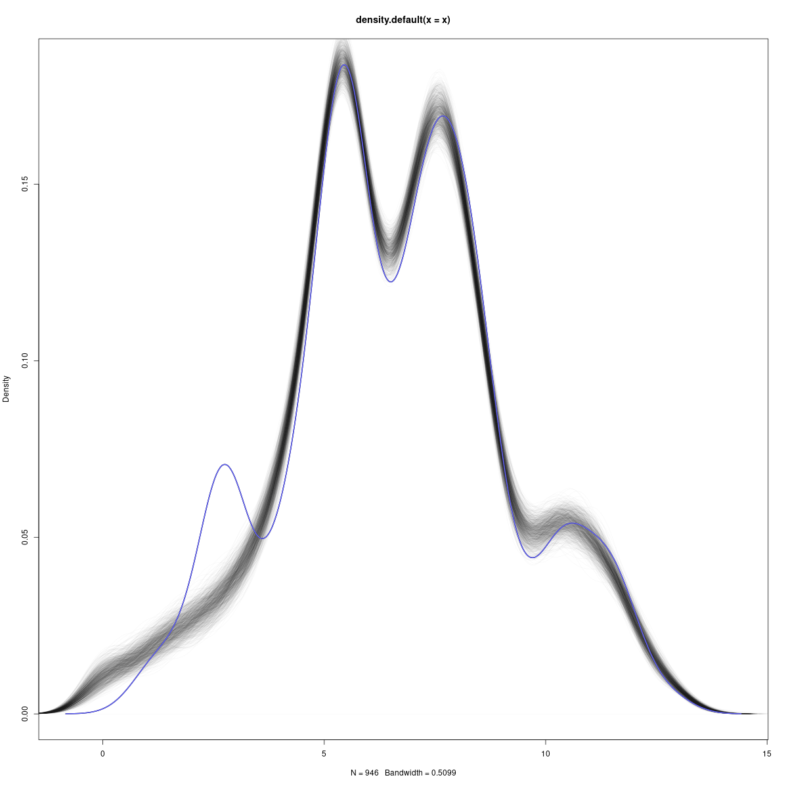

Estimating Conflict Losses and Reporting Biases
===============================================

**Replication archive** for Radford et al. (2023), ["Estimating Conflict Losses and Reporting Biases"](https://www.pnas.org/doi/10.1073/pnas.2307372120) in PNAS.

[Benjamin J. Radford](https://www.benradford.com)  
[Yaoyao Dai](https://www.daiyaoyao.com)  
[Niklas Stoehr](https://niklas-stoehr.com/)  
[Aaron Schein](https://www.aaronschein.com/)  
Mya Fernandez   
Hanif Sajid

<a href="./POLMETH_2023_poster.pdf"></a> 
_Figure: a poster summarizing this work that was presented at the Annual Meeting of the Society for Political Methodology (POLMETH 2023)._


# Table of Contents

* [Requirements](#requirements)
* [Repository Contents](#repository-contents)
* [Data](#data)
* [Replicating the Original Model](#replicating-the-original-model)
* [Robustness Tests](#robustness-tests)
  - [Review Response Letters](#review-response-letters)
  - [Robustness Test Materials](#robustness-test-materials)
  - [Cross Validation](#cross-validation)
* [FAQ](#faq)
* [Cite this Paper](#cite-this-paper)

# Requirements

You will need [R](https://www.r-project.org/), [Stan](https://mc-stan.org/), and the following R packages:

* [rstan](https://mc-stan.org/users/interfaces/rstan)
* [stringr](https://stringr.tidyverse.org/)
* [bayesplot](http://mc-stan.org/bayesplot/)
* [xtable](https://cran.r-project.org/web/packages/xtable/index.html)
* [narray](https://cran.r-project.org/web/packages/narray/index.html)

In addition, you will need a lot of time, patience, disk space, and reasonable computing power.

# Repository Contents
<details>
  <summary>Click here for a file tree of this repository.</summary>
  
```
.
├── data
│   └── replication-data-pnas.csv
├── model_original
│   ├── 01-run.R
│   ├── 02-analyze-results.R
│   ├── data-original.RData
│   └── model.stan
├── review_response_letters
│   ├── review_response_01.pdf
│   └── review_response_02.pdf
├── robustness_bias_priors
│   ├── 01-run-original.R
│   ├── 02-run-l2bias.R
│   ├── 03-run-hyperbias.R
│   ├── 04-run-l2bias-hyperbias.R
│   ├── 05-analyze-original.R
│   ├── 06-analyze-l2bias.R
│   ├── 07-analyze-hyperbias.R
│   ├── 08-analyze-l2bias-hyperbias.R
│   ├── 09-make-plots.R
│   ├── all_biases.pdf
│   ├── bias_priors_on_bias.pdf
│   ├── bias_priors_on_losses.pdf
│   ├── data-original.RData
│   ├── model-hyperbias.stan
│   ├── model-l2bias-hyperbias.stan
│   ├── model-l2bias.stan
│   └── model-original.stan
├── robustness_cross_validation
│   ├── 01-run-cv-1.R
│   ├── 02-run-cv-2.R
│   ├── 03-run-cv-3.R
│   ├── 04-run-cv-4.R
│   ├── 05-run-cv-5.R
│   ├── model.stan
│   ├── ppc_density_1.png
│   ├── ppc_density_2.png
│   ├── ppc_density_3.png
│   ├── ppc_density_4.png
│   ├── ppc_density_5.png
│   ├── scatterplot_1.png
│   ├── scatterplot_2.png
│   ├── scatterplot_3.png
│   ├── scatterplot_4.png
│   └── scatterplot_5.png
├── robustness_fixed_effects
│   ├── 01-run-fixed-effects.R
│   ├── 02-analyze-fixed-effects.R
│   ├── data-original.RData
│   ├── fe_biases.pdf
│   └── model-fixed-effects.stan
├── robustness_imbalance
│   ├── 01-run-ru-2x.R
│   ├── 02-run-ru-3x.R
│   ├── 03-run-ru-4x.R
│   ├── 04-run-ru-5x.R
│   ├── 05-run-ua-2x.R
│   ├── 06-run-ua-3x.R
│   ├── 07-run-ua-4x.R
│   ├── 08-run-ua-5x.R
│   ├── 09-analysis-ru.R
│   ├── 10-analysis-ua.R
│   ├── 11-make-plots-ru.R
│   ├── 12-make-plots-ua.R
│   ├── data-ru-2x.RData
│   ├── data-ru-3x.RData
│   ├── data-ru-4x.RData
│   ├── data-ru-5x.RData
│   ├── data-ua-2x.RData
│   ├── data-ua-3x.RData
│   ├── data-ua-4x.RData
│   ├── data-ua-5x.RData
│   ├── model.stan
│   ├── ru_rep_bias.pdf
│   ├── ru_rep_loss.pdf
│   ├── ua_rep_bias.pdf
│   └── ua_rep_loss.pdf
├── robustness_nociv
│   ├── 01-run.R
│   ├── 02-analyze-results.R
│   ├── data-nociv.RData
│   └── model.stan
├── LICENSE
└── README.md
```

</details>

# Data

We provide the data in two formats. First, a comma separated values file can be found in `./data/replication-data-pnas.csv`. This file has the following fields:

1. `days` (integer) number of days since February 23, 2022.
2. `loss_count` (integer) reported number of losses.
3. `loss_type` (string) the loss category concatenated with the target country (e.g., "Military Deaths-Russia").
4. `claim_source` (string) the country or other reporting source from which the report originated.
5. `time_frame` (string) one of "Cumulative" or "Day" to denote the time period for which the loss report is for.
6. `loss_country` (string) one of "Russia" or "Ukraine" to denote the country to whom the loss report refers.
7. `minimum` (binary) one if the report represents a lower bound estimate (e.g., "at least X soldiers...").
8. `maximum` (binary) one if the report represents an upper bound estimate (e.g., "as many as X soldiers...").
9. `category` (string) the loss category (e.g., "AA Systems" or "Military Deaths").
10. `source_target` (string) the `claim_source` and `loss_country` variables concatenated with a hyphen.

We also provide data in .RData format for easy loading in R. These files appear in their respective analysis folders and sometimes differ in content from the data provided in the CSV file. They differ in three ways: (1) the data contained within the RData files are already split into cumulative (`data`) and daily (`data_daily`) dataframes rather than combined into a single dataframe; (2) the column `loss_count` from the CSV is confusingly referred to as `loss_count_min`; (3) for the robustness tests, the data have already been manipulated and may not be equivalent in content to the original data from the CSV. 

The RData files called `data-original.RData` are all equivalent in content to `replication-data-pnas.csv`. RData files with other names have been manipulated for the purposes of robustness tests. For example, `data-ru-2x.RData` is the same as the original data except that all Russian reports have been duplicated one time. `data-nociv.RData` is equivalent to the original data except that all civilian loss categories have been omitted.


# Replicating the Original Model

We refer to the model presented in the published report as the "original model." The original model code is found in the folder named `./model_original`. This folder contains the following files:

* `model.stan` is the Stan code for estimating the model.
* `data-original.RData` is an RData object that contains two dataframes (`data` and `data_daily`).
* `01-run.R` is the R script that imports `data-original.RData` and runs the model.
* `02-analyze-results.R` produces the numbers, tables, and plots found in the published brief report.

To reproduce the results found in the brief report, set your R working directory to `./model_original` and run `01-run.R` and `02-analyze-results.R` in order.


# Robustness Tests

## Review Response Letters

We were fortunate to receive two rounds of very thoughtful and thorough reviews from two very helpful reviewers. These resulted in a much improved manuscript and we are very grateful to the anonymous reviewers. More importantly, these reviews prompted us to undertake a number of robustness tests of our model. We include our response letters to these reviews and all code necessary to replicate all robustness tests.

## Robustness Test Materials

In addition to the replication materials for the results presented in the published brief report, we also provide several sets of robustness tests. These are found in the following folders:

* `./robustness_cross_validation` is a five-fold cross validation to evaluate the model's ability to make predictions out-of-sample. 
* `./robustness_imbalance` is for estimating models that replicate the RU and UA source data 2, 3, 4, and 5 times to assess the model's robustness to source imbalance (see [Review Response 1](./review_response_letters/review_response_01.pdf) p. 13).
* `./robustness_bias_priors` is for evaluating model performance across various alternative prior specifications for the source bias terms (see [Review Response 1](./review_response_letters/review_response_01.pdf) p. 18). This one also produces a plot of all estimated bias terms (see [Review Response 1](./review_response_letters/review_response_01.pdf) p. 7).
* `./robustness_fixed_effects` is for estimating a "fixed effects" version of this model wherein a uniform improper prior is placed on the bias terms (see [Review Response 2](./review_response_letters/review_response_02.pdf)).
* `./robustness_nociv` is for evaluating the model's robustness to the removal of civilian fatalities, casualties, and injuries (see [Review Response 1](./review_response_letters/review_response_01.pdf) p. 22).

For replicating each robustness test, please run the R scripts in numerical order. Note that some robustness tests require that `./model_original` has been populated with an estimated Stan model object.

All robustness tests except the cross validation are described in our _Response to Reviewers 1_ and _Response to Reviewers 2_.  

## Cross Validation

While all other robustness tests are described in the included review response letters, the 5-fold cross validation is not. We include below the posterior predictive distributions (daily and cumulative) for each of the five folds. Models are estimated on four folds and compared against the observed values from the out-of-sample fifth fold. The posterior density for losses (daily and cumulative, combined) is given in gray while the observed out-of-sample density is depicted in blue. In the right-most column, we also provide a scatterplot of observed out-of-sample values (X) and predicted values (Y) for each fold. Vertical lines denote 95% posterior predictive intervals.

The cross validation can be performed with the files in `./robustness_cross_validation`. 

 |     | Posterior Predictive Check | Predicted v. Observed |  
 | --- | -------------------------- | --------------------- | 
 | Fold 1 |  |  |  
 | Fold 2 |  |  |  
 | Fold 3 |  |  |  
 | Fold 4 |  |  |  
 | Fold 5 |  |  |  


# FAQ

**Q: How long will it take to run the models?**

A: We ran our models on a SLURM cluster with 6 cores per model (corresponding to 6 MCMC chains) and 96Gb of RAM per model. These models took several hours to fit, but typically less than a full day.

**Q: My numbers or figures don't match yours precisely. Why not?**

A: We cleaned up our code substantially between producing the models presented in the paper and publishing our replication archive. We did this for clarity and also to remove directories and information that are specific to the researchers' computing environments (e.g., absolute paths). It is possible, though unlikely, that this results in slight differences to, for example, the random subsets that are selected in the cross validation robustness tests. More likely, differences in computing hardware and software versions are to blame. If your results differ substantially from those reported in the paper or in the robustness tests, please contact us.


# Cite this Paper

Radford, Benjamin J., Yaoyao Dai, Niklas Stoehr, Aaron Schein, Mya Fernandez, and Hanif Sajid. 2023. "Estimating Conflict Losses and Reporting Biases." _Proceedings of the National Academy of Sciences_ 120 (34). doi:10.1073/pnas.2307372120. URL: [https://www.pnas.org/doi/abs/10.1073/pnas.2307372120](https://www.pnas.org/doi/abs/10.1073/pnas.2307372120).

```
@article{
  doi:10.1073/pnas.2307372120,
  author = {Benjamin J. Radford  and Yaoyao Dai  and Niklas Stoehr  and Aaron Schein  and Mya Fernandez  and Hanif Sajid },
  title = {Estimating conflict losses and reporting biases},
  journal = {Proceedings of the National Academy of Sciences},
  volume = {120},
  number = {34},
  pages = {e2307372120},
  year = {2023},
  doi = {10.1073/pnas.2307372120},
  URL = {https://www.pnas.org/doi/abs/10.1073/pnas.2307372120},
  eprint = {https://www.pnas.org/doi/pdf/10.1073/pnas.2307372120},
  abstract = {Determining the number of casualties and fatalities suffered in militarized conflicts is important for conflict measurement, forecasting, and accountability. However, given the nature of conflict, reliable statistics on casualties are rare. Countries or political actors involved in conflicts have incentives to hide or manipulate these numbers, while third parties might not have access to reliable information. For example, in the ongoing militarized conflict between Russia and Ukraine, estimates of the magnitude of losses vary wildly, sometimes across orders of magnitude. In this paper, we offer an approach for measuring casualties and fatalities given multiple reporting sources and, at the same time, accounting for the biases of those sources. We construct a dataset of 4,609 reports of military and civilian losses by both sides. We then develop a statistical model to better estimate losses for both sides given these reports. Our model accounts for different kinds of reporting biases, structural correlations between loss types, and integrates loss reports at different temporal scales. Our daily and cumulative estimates provide evidence that Russia has lost more personnel than has Ukraine and also likely suffers from a higher fatality to casualty ratio. We find that both sides likely overestimate the personnel losses suffered by their opponent and that Russian sources underestimate their own losses of personnel.}
}
```
